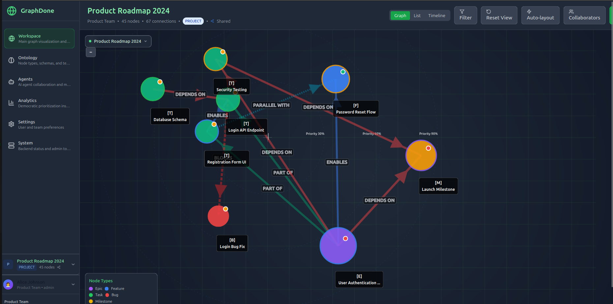

# GraphDone

> Project management for teams who think differently. Coordinate through dependencies and outcomes, not hierarchies and assignments.




## What is GraphDone?

GraphDone reimagines project management as a collaborative graph where work flows through natural dependencies rather than artificial hierarchies. It's designed for high-quality individual contributors who thrive on autonomy, teams that include AI agents, and organizations ready to embrace democratic coordination.

**Key Features:**
- 🌐 **Graph-native collaboration** - Visualize work as interconnected outcomes and dependencies
- 📱 **Mobile-first design** - Touch-friendly interface for distributed teams
- 🤖 **AI agent integration** - Humans and AI coordinate as peers through the same interface
- 🗳️ **Democratic prioritization** - Anonymous rating system lets good ideas rise organically
- 🎯 **Spherical priority model** - Ideas migrate from periphery to center based on community validation
- 🌍 **Open source** - MIT licensed with no vendor lock-in

## How GraphDone Differs from Traditional PM Tools

| Traditional PM | GraphDone |
|----------------|-----------|
| Hierarchical task assignment | Natural dependency flows |
| Manager-driven priorities | Democratic community validation |
| Linear project timelines | Spherical priority space |
| Human-only collaboration | Human + AI peer collaboration |
| Top-down resource allocation | Priority-based resource migration |
| Rigid organizational structure | Emergent network coordination |

## Philosophy

GraphDone is built on the belief that:

- **Work flows through dependencies, not hierarchies** - Real work has natural constraints and sequences that create the actual structure of how things get done
- **People contribute best when they choose how** - High-quality contributors are driven by intrinsic motivation, not external pressure
- **Ideas can come from anywhere** - Innovation doesn't respect organizational hierarchy
- **Collaboration should include all intelligences** - AI agents should be first-class collaborators, not separate tools

[Read our complete philosophy →](./docs/philosophy.md)

## Quick Start

### One-Command Setup

```bash
git clone https://github.com/your-org/graphdone.git
cd graphdone
./setup.sh
./run.sh
```

Visit http://localhost:3000 to see the working application!

### What You Get

- 🌐 **Web Application**: Full graph visualization and collaboration interface
- 🔗 **GraphQL API**: Complete backend with real-time subscriptions  
- 🗄️ **Database**: PostgreSQL with graph-optimized schema
- 🐳 **Docker Setup**: Development and production containers
- 🧪 **Testing**: Comprehensive test suite with coverage reporting

## Core Concepts

### Graph Structure
Work is modeled as interconnected **nodes** (outcomes, tasks, milestones) connected by **edges** (dependencies, relationships). Contributors—both human and AI—participate as first-class citizens in this graph.

### Spherical Priority Model  
Items exist in 3D space where priority determines distance from center. High-priority work gets full resources at the center, while experimental ideas start at the periphery with minimal resources, migrating inward as they prove value.

### Democratic Prioritization
Anyone can propose ideas and assign personal priority. The community validates through anonymous rating. Ideas that gain support naturally migrate toward higher priority and more resources—no executive approval required.

## Documentation

- 📖 **[Complete Technical Overview](./docs/detailed-overview.md)** - Architecture, implementation details, and visual deep-dive
- 🎯 **[Project Philosophy](./docs/philosophy.md)** - Core beliefs and design principles  
- 🚀 **[Getting Started Guide](./docs/guides/getting-started.md)** - Step-by-step setup and first steps
- 🏗️ **[Architecture Overview](./docs/guides/architecture-overview.md)** - System design and technical decisions
- 👥 **[User Flows](./docs/guides/user-flows.md)** - How teams actually use GraphDone
- 🔌 **[API Documentation](./docs/api/graphql.md)** - GraphQL schema and integration guide
- 🚀 **[Deployment Guide](./docs/deployment/README.md)** - Self-hosted and cloud deployment options

## Contributing

GraphDone is built for and by teams who think differently. We welcome contributions that advance our mission of democratic, graph-native coordination.

**High-Impact Areas:**
- Graph algorithms and optimization
- Mobile touch interactions  
- AI agent integration
- Accessibility and neurodiversity support
- Performance for large graphs

**Get Started:**
1. Run `./setup.sh && ./run.sh` to see the system working
2. Read our [philosophy](./docs/philosophy.md) and [architecture](./docs/guides/architecture-overview.md)
3. Pick an area that excites you and matches your skills
4. Join discussions in GitHub Issues and pull requests

[Complete contributing guide →](./docs/detailed-overview.md#contributing)

## License

Open source software licensed under the [MIT License](./LICENSE).

---

*Built with ❤️ for teams who think differently*