# GraphDone

> Project management for teams who think differently. Coordinate through dependencies and outcomes, not hierarchies and assignments. Open source, mobile-first, AI-native.


## What is GraphDone?

GraphDone reimagines project management as a collaborative graph where work flows through natural dependencies rather than artificial hierarchies. It's designed for high-quality individual contributors who thrive on autonomy, teams that include AI agents, and organizations ready to embrace democratic coordination.

**Key Features:**
- 🌐 **Graph-native collaboration** - Visualize work as interconnected outcomes and dependencies
- 📱 **Mobile-first design** - Touch-friendly interface for distributed teams
- 🤖 **AI agent integration** - Humans and AI coordinate as peers through the same interface
- 🗳️ **Democratic prioritization** - Anonymous rating system lets good ideas rise organically
- 🎯 **Spherical priority model** - Ideas migrate from periphery to center based on community validation
- 💰 **Accessible pricing** - $5/user/month with full-featured free tier

[Read our full philosophy](./philosophy.md)

## How GraphDone Works: A Visual Deep Dive

### The Core Concept: Work as a Graph

Traditional project management tools organize work in linear lists or hierarchical trees. GraphDone models work as it actually exists - a network of interconnected outcomes, dependencies, and relationships.

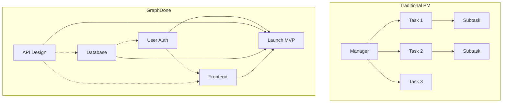

### The Spherical Priority Model

Work items exist in a 3D spherical space where priority determines distance from center. This creates natural resource allocation and visibility.

```mermaid
graph TD
    subgraph "Spherical Priority Space"
        CENTER[🎯 Center<br/>Highest Priority<br/>Full Resources]
        
        subgraph "Inner Sphere"
            I1[Critical Feature A]
            I2[Security Fix]
            I3[Performance Issue]
        end
        
        subgraph "Middle Sphere"
            M1[New Feature B]
            M2[Code Refactor]
            M3[Documentation]
        end
        
        subgraph "Outer Sphere"
            O1[Research Project]
            O2[Future Ideas]
            O3[Experiments]
        end
        
        CENTER --- I1
        CENTER --- I2
        CENTER --- I3
        I1 -.-> M1
        I2 -.-> M2
        M1 -.-> O1
        M2 -.-> O2
    end
```

### Democratic Prioritization Process

Ideas can migrate inward through community validation, creating a natural innovation pipeline without requiring executive approval.

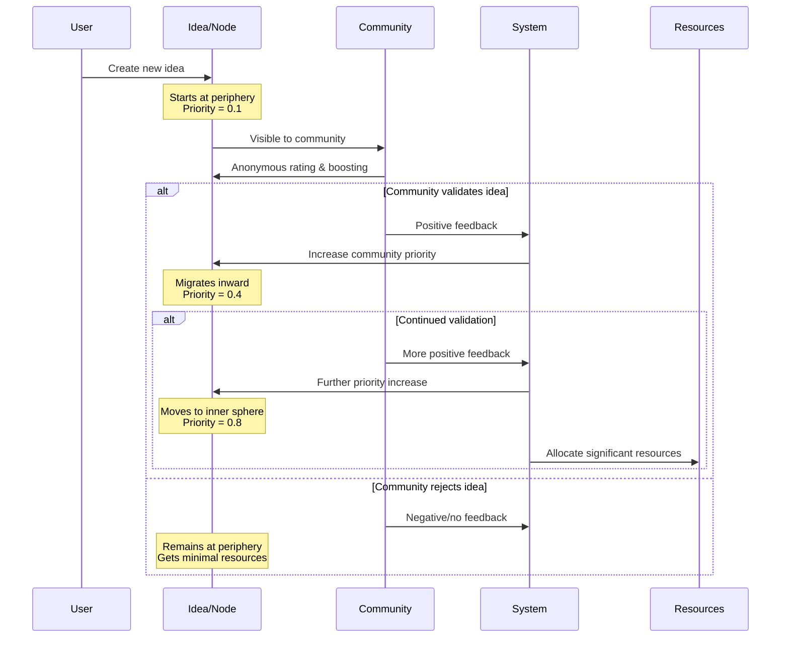

### Human-AI Collaboration Model

GraphDone treats AI agents as first-class citizens in the collaboration graph, not as separate tools or automations.

```mermaid
graph LR
    subgraph "Collaboration Graph"
        H1[👤 Human<br/>Designer]
        H2[👤 Human<br/>Developer] 
        A1[🤖 AI Agent<br/>Code Review]
        A2[🤖 AI Agent<br/>Testing]
        
        N1[Design System]
        N2[Component Library]
        N3[User Testing]
        N4[Performance Optimization]
        
        H1 --> N1
        H1 --> N2
        H2 --> N2
        A1 --> N2
        H2 --> N4
        A2 --> N4
        N2 --> N3
        A2 --> N3
        
        N1 -.-> N2
        N2 -.-> N4
    end
```

### Multi-Dimensional Priority System

Each node has three priority dimensions that combine into a computed priority determining its position in the sphere.

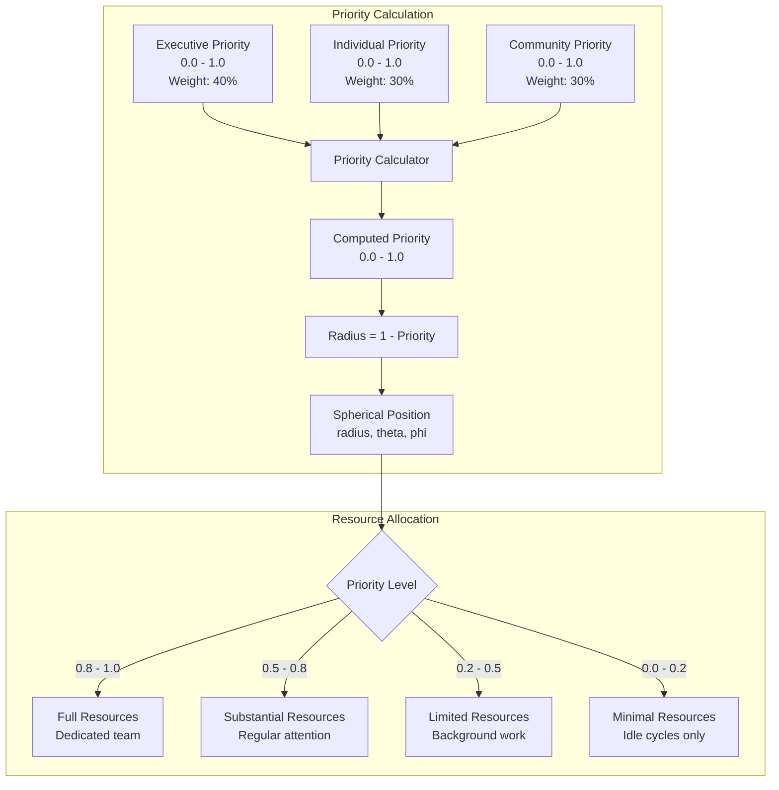

## Architecture Deep Dive

### System Architecture Overview

GraphDone is built as a distributed, real-time system with clear separation between graph engine, API layer, and presentation layers.

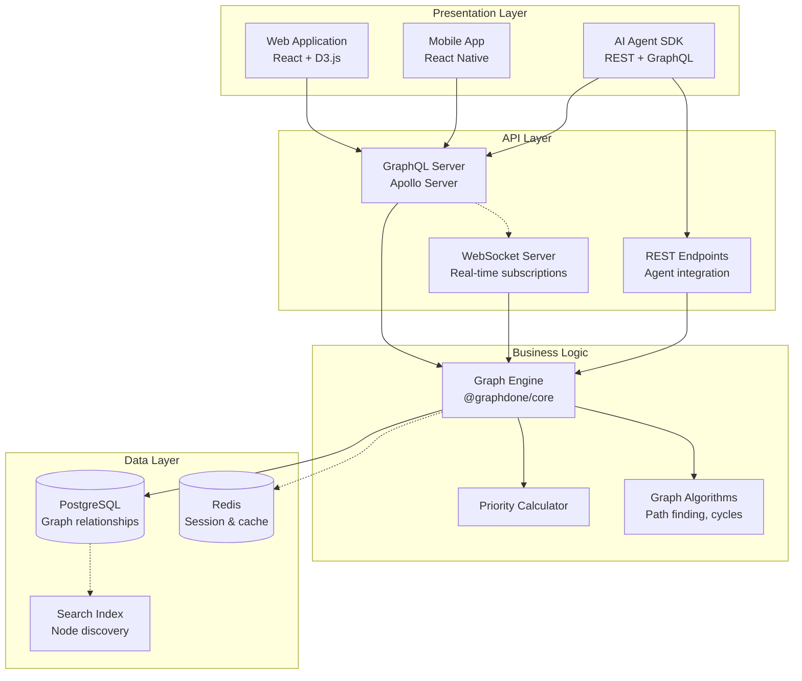

### Data Flow Architecture

Real-time updates flow through the system ensuring all participants see changes immediately.

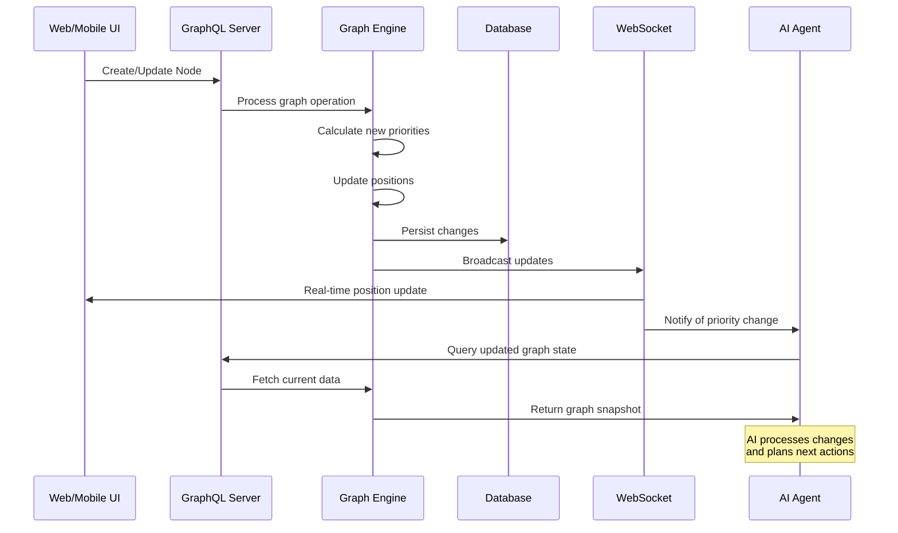

## Repository Structure

```
graphdone/
├── packages/
│   ├── core/              # Graph engine and algorithms
│   ├── server/            # GraphQL API server
│   ├── web/               # React web application
│   └── agent-sdk/         # SDK for AI agents (planned)
├── docs/
│   ├── api/               # API documentation
│   ├── guides/            # User and developer guides
│   ├── examples/          # Integration examples
│   └── deployment/        # Deployment guides
├── scripts/               # Development and deployment scripts
├── .github/workflows/     # CI/CD pipelines
└── docker-compose.yml    # Development environment
```

## Technology Stack & Implementation

### Technology Architecture

The system is built with modern, scalable technologies optimized for real-time collaboration and graph operations.

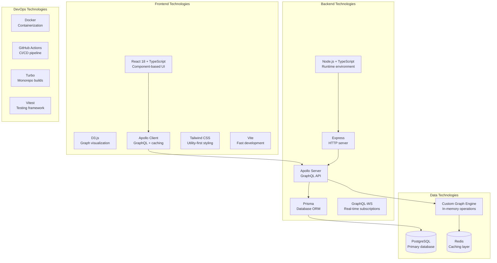

### Core Graph Engine Implementation

The heart of GraphDone is a custom graph engine optimized for collaborative workflows and real-time updates.

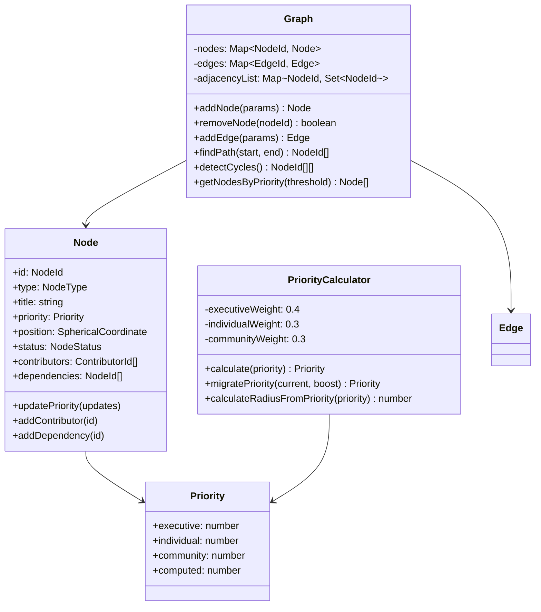

### Real-Time Update Flow

GraphDone maintains real-time synchronization across all clients using WebSocket subscriptions and optimistic updates.

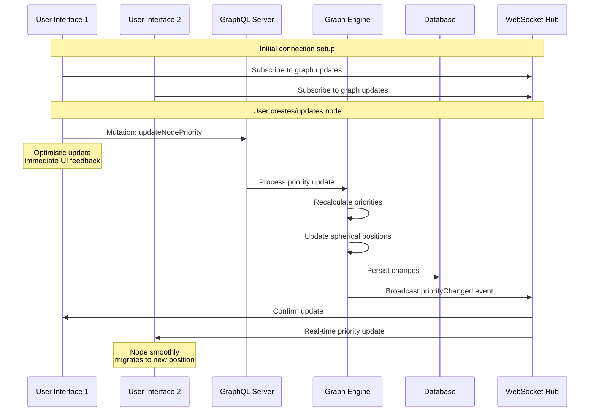

### GraphQL Schema Architecture

The API is designed around graph operations and real-time collaboration patterns.

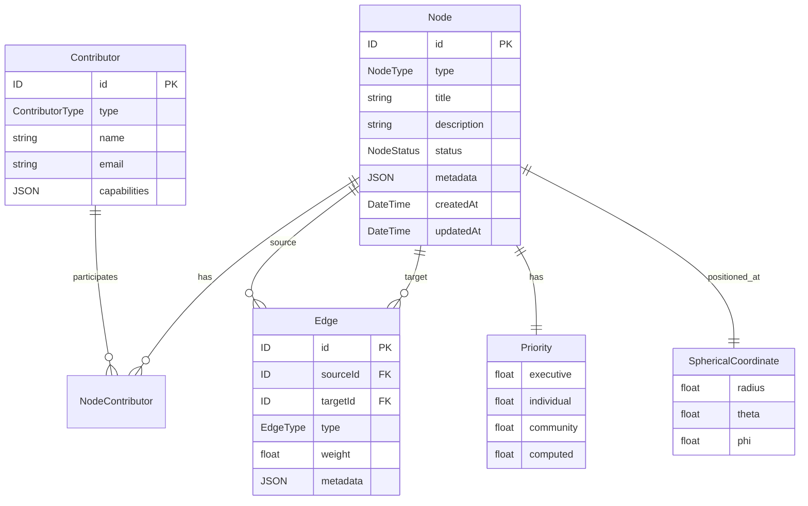

## Quick Start

### One-Command Setup

GraphDone includes a comprehensive setup script that handles all prerequisites and configuration.

```bash
# Clone and setup
git clone https://github.com/your-org/graphdone.git
cd graphdone
./setup.sh
```

The setup script will:
1. ✅ Check prerequisites (Node.js 18+, Docker, npm)
2. 📦 Install all dependencies with workspace configuration
3. 🔧 Create environment files from examples
4. 🐘 Start PostgreSQL and Redis databases
5. 🗄️ Run database migrations and generate Prisma client
6. 🏗️ Build all packages

### Development Workflow

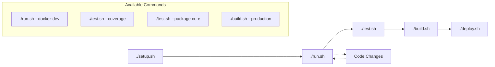

### Running the System

Start all development servers:
```bash
./run.sh
```

This provides:
- 🌐 **Web Application**: http://localhost:3000
- 🔗 **GraphQL API**: http://localhost:4000/graphql  
- 📊 **GraphQL Playground**: Interactive API explorer
- 🔌 **WebSocket Subscriptions**: ws://localhost:4000/graphql
- ❤️ **Health Check**: http://localhost:4000/health

### Testing Your Setup

Verify everything works with these quick tests:

```bash
# Test API health
curl http://localhost:4000/health

# Create a test node
curl -X POST http://localhost:4000/graphql \
  -H "Content-Type: application/json" \
  -d '{"query": "mutation { createNode(input: { type: TASK, title: \"My First Node\" }) { id title priority { computed } } }"}'

# Query all nodes
curl -X POST http://localhost:4000/graphql \
  -H "Content-Type: application/json" \
  -d '{"query": "{ nodes { id title type priority { computed } position { radius } } }"}'
```

### Docker Development Options

For containerized development:

```bash
# Full Docker development environment
./run.sh --docker-dev

# Production-like environment
./run.sh --docker

# Individual service testing
docker-compose up -d postgres  # Database only
```

### Development Tools Integration

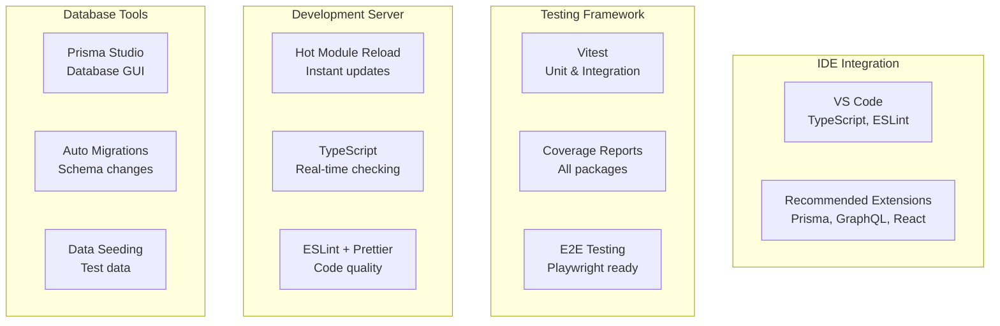

## Core Concepts

### Graph Structure
- **Nodes**: Outcomes, tasks, milestones, contributors (human and AI)
- **Edges**: Dependencies, relationships, priorities
- **Coordinates**: 3D spherical positioning based on priority and connections

### Priority System
- **Executive flags**: Strategic priority signals from leadership
- **Individual priority**: Personal background priority assignment
- **Democratic weighting**: Anonymous community rating and boosting
- **Migration algorithms**: Ideas move toward center based on validation

### Agent Integration
- **Graph API**: Agents read/write graph state through standard endpoints
- **Event system**: Real-time notifications for graph changes
- **Resource allocation**: Agents can request compute resources based on node priority
- **Collaborative protocols**: Standard patterns for human-AI coordination

## API Overview

### GraphQL Schema
```graphql
type Node {
  id: ID!
  type: NodeType!
  title: String!
  description: String
  position: SphericalCoordinate!
  priority: Priority!
  contributors: [Contributor!]!
  dependencies: [Node!]!
  status: NodeStatus!
}

type Priority {
  executive: Float
  individual: Float
  community: Float
  computed: Float
}
```

### Agent SDK Example
```javascript
import { GraphDoneAgent } from '@graphdone/agent-sdk';

const agent = new GraphDoneAgent({
  apiKey: process.env.GRAPHDONE_API_KEY,
  graphUrl: 'https://api.graphdone.com'
});

// Listen for new high-priority outcomes
agent.subscribe('node.priorityChanged', async (node) => {
  if (node.priority.computed > 0.8) {
    await agent.requestResources({
      nodeId: node.id,
      resourceType: 'gpu',
      duration: '30m'
    });
  }
});
```

## Implementation Status & Next Steps

### ✅ **Completed Foundation**
- **Core Graph Engine**: Full implementation with priority calculation, pathfinding, cycle detection
- **GraphQL API**: Complete server with real-time subscriptions
- **Database Layer**: PostgreSQL with Prisma ORM and proper relationships
- **Web Application**: React + D3.js visualization with responsive design
- **Development Infrastructure**: Monorepo, testing, Docker, CI/CD
- **Documentation**: Comprehensive guides with Mermaid diagrams

### 🚀 **Ready for Development**
```bash
# Get started in 30 seconds
git clone https://github.com/your-org/graphdone.git
cd graphdone
./setup.sh
./run.sh
```

Visit http://localhost:3000 to see the working application!

### 🛣️ **Development Roadmap**

```mermaid
gantt
    title GraphDone Development Roadmap
    dateFormat  YYYY-MM-DD
    section Foundation ✅
    Core Engine          :done, foundation, 2024-01-01, 2024-03-01
    API & Database       :done, api, 2024-02-01, 2024-04-01
    Web Application      :done, web, 2024-03-01, 2024-05-01
    
    section Alpha Release
    Mobile App           :mobile, 2024-05-01, 2024-07-01
    AI Agent SDK         :agents, 2024-06-01, 2024-08-01
    Real-time Polish     :realtime, 2024-07-01, 2024-08-01
    
    section Beta Release
    Advanced Analytics   :analytics, 2024-08-01, 2024-10-01
    Enterprise Features  :enterprise, 2024-09-01, 2024-11-01
    Performance Scaling  :scaling, 2024-10-01, 2024-12-01
    
    section Production
    Security Hardening   :security, 2024-11-01, 2025-01-01
    Production Deploy    :deploy, 2024-12-01, 2025-02-01
```

## Contributing

GraphDone is built for and by teams who think differently. We welcome contributions that advance our mission of democratic, graph-native coordination.

### 🎯 **High-Impact Contribution Areas**
- **Graph Algorithms**: Enhance priority propagation and conflict resolution
- **Mobile Experience**: Perfect touch interactions for 3D graph manipulation  
- **AI Agent Integration**: Build the SDK and example agents
- **Accessibility**: Make graph visualization work for screen readers
- **Performance**: Optimize for large graphs (1000+ nodes)
- **Neurodiversity Support**: Design patterns for different cognitive styles

### 📚 **Essential Reading**
- [Project Philosophy](./philosophy.md) - Understanding the "why"
- [Architecture Overview](./docs/guides/architecture-overview.md) - Technical deep dive
- [User Flows](./docs/guides/user-flows.md) - Interaction patterns
- [API Documentation](./docs/api/graphql.md) - Developer reference

### 🚀 **Getting Started**
1. **Explore**: Run `./setup.sh && ./run.sh` to see the system working
2. **Understand**: Read our philosophy and architecture docs
3. **Contribute**: Pick an area that excites you and matches your skills
4. **Connect**: Join discussions in GitHub Issues and pull requests

### 🔧 **Development Workflow**
```bash
# Set up development environment
./setup.sh

# Make your changes
git checkout -b feature/your-improvement

# Test your changes
./test.sh --coverage

# Build and verify
./build.sh

# Submit your contribution
git push origin feature/your-improvement
# Open a Pull Request with clear description
```

## Deployment

### Self-Hosted
```bash
# Using Docker Compose
docker-compose -f docker-compose.prod.yml up -d

# Using Kubernetes
kubectl apply -f tools/deployment/k8s/
```

### Cloud Hosting
- **AWS**: ECS/EKS deployment guides in `docs/deployment/aws/`
- **GCP**: GKE deployment guides in `docs/deployment/gcp/`
- **Azure**: AKS deployment guides in `docs/deployment/azure/`

## Roadmap

### v0.1.0 - Alpha (Current)
- [x] Basic graph visualization
- [x] Mobile-responsive interface
- [x] Real-time collaboration
- [ ] Agent SDK foundation
- [ ] Democratic prioritization

### v0.2.0 - Beta
- [ ] Spherical coordinate system
- [ ] Anonymous rating system
- [ ] Advanced graph algorithms
- [ ] Agent marketplace foundation
- [ ] Enterprise authentication

### v1.0.0 - Stable
- [ ] Full agent ecosystem
- [ ] Advanced analytics
- [ ] Enterprise features
- [ ] Third-party integrations
- [ ] Performance optimization


## License

GraphDone is open source software licensed under the [MIT License](./LICENSE).


---

*Built with ❤️ for teams who think differently*
