# GraphDone User Flows & Interaction Patterns

**AI-Generated Content Warning: This documentation contains AI-generated content. Verify information before depending on it for decision making.**

## Core User Flows

### 1. New User Onboarding Flow

Understanding how users first experience GraphDone's unique approach to project management.


### 2. Daily Collaboration Flow

How teams use GraphDone for ongoing project coordination.


### 3. Idea Evolution Flow

How ideas migrate from periphery to center through community validation.

```mermaid
graph TD
    START[💡 New Idea Created] --> PERIPHERY[📍 Positioned at Periphery<br/>Priority: 0.1<br/>Resources: Minimal]
    
    PERIPHERY --> VISIBILITY[👁️ Visible to Community<br/>Anonymous rating enabled]
    
    VISIBILITY --> COMMUNITY_CHOICE{Community Response}
    
    COMMUNITY_CHOICE -->|Positive Feedback| BOOST1[⬆️ Community Boost<br/>Priority: 0.3<br/>Moves closer to center]
    COMMUNITY_CHOICE -->|No Feedback| STAGNATE[⏸️ Remains at Periphery<br/>Gets idle resources only]
    COMMUNITY_CHOICE -->|Negative Feedback| DECLINE[⬇️ Moves further out<br/>Reduced visibility]
    
    BOOST1 --> ATTENTION[👀 Increased Visibility<br/>More team members see it]
    ATTENTION --> VALIDATION{Continued Validation}
    
    VALIDATION -->|Strong Support| BOOST2[⬆️⬆️ Major Boost<br/>Priority: 0.7<br/>Enters inner sphere]
    VALIDATION -->|Mixed Response| PLATEAU[➡️ Stabilizes<br/>Middle sphere position]
    VALIDATION -->|Support Wanes| DECLINE
    
    BOOST2 --> RESOURCES[💰 Substantial Resources<br/>Team assignment<br/>Active development]
    RESOURCES --> EXECUTION[🔨 Active Development<br/>Regular updates<br/>Progress tracking]
    
    EXECUTION --> SUCCESS{Outcome}
    SUCCESS -->|Delivers Value| REINFORCE[🔄 Reinforced Position<br/>Continued high priority]
    SUCCESS -->|Fails to Deliver| REASSESS[🔍 Community Reassessment<br/>May lose priority]
    
    PLATEAU --> EVOLUTION[🔄 Continuous Evolution<br/>Based on changing needs]
    EVOLUTION --> VALIDATION
    
    style START fill:#e1f5fe
    style BOOST2 fill:#c8e6c9
    style RESOURCES fill:#fff3e0
    style DECLINE fill:#ffcdd2
```



### 4. Human-AI Collaboration Patterns

How humans and AI agents coordinate as peers in the graph.

```mermaid
graph LR
    subgraph "Human Activities"
        H1[👤 Create Strategic Goals]
        H2[👤 Design User Experience]
        H3[👤 Make Creative Decisions]
        H4[👤 Validate Community Needs]
    end
    
    subgraph "AI Agent Activities" 
        A1[🤖 Code Review & Testing]
        A2[🤖 Performance Analysis]
        A3[🤖 Documentation Generation]
        A4[🤖 Risk Assessment]
    end
    
    subgraph "Shared Graph Space"
        N1[Strategic Outcome]
        N2[Feature Implementation]
        N3[Quality Assurance]
        N4[Performance Metrics]
        N5[User Documentation]
    end
    
    H1 --> N1
    H2 --> N2
    H3 --> N2
    H4 --> N1
    
    A1 --> N3
    A2 --> N4
    A3 --> N5
    A4 --> N1
    
    N1 -.-> N2
    N2 -.-> N3
    N3 -.-> N4
    N2 -.-> N5
    
    style H1 fill:#e3f2fd
    style H2 fill:#e3f2fd
    style H3 fill:#e3f2fd
    style H4 fill:#e3f2fd
    style A1 fill:#f3e5f5
    style A2 fill:#f3e5f5
    style A3 fill:#f3e5f5
    style A4 fill:#f3e5f5
```



## Interaction Patterns

### Priority Adjustment Patterns

Different ways priority can change in the system.

```mermaid
graph TB
    subgraph "Executive Influence"
        EXEC_FLAG[🏛️ Executive Flag<br/>Strategic priority signal]
        EXEC_GRAVITY[🌟 Creates Gravity Well<br/>Attracts related work]
    end
    
    subgraph "Individual Influence"
        PERSONAL[👤 Personal Priority<br/>Individual importance]
        CONTRIBUTION[🔨 Active Contribution<br/>Working on node]
    end
    
    subgraph "Community Influence"
        ANONYMOUS[👥 Anonymous Rating<br/>Peer validation]
        BOOST[⬆️ Community Boost<br/>Collective energy]
        NETWORK[🕸️ Network Effects<br/>Connected node priority]
    end
    
    subgraph "Algorithmic Influence"
        DEPENDENCY[🔗 Dependency Priority<br/>Inherited importance]
        TIME_DECAY[⏰ Time-based Decay<br/>Prevents stagnation]
        USAGE[📊 Usage Patterns<br/>Actual engagement]
    end
    
    EXEC_FLAG --> EXEC_GRAVITY
    PERSONAL --> CONTRIBUTION
    ANONYMOUS --> BOOST
    BOOST --> NETWORK
    DEPENDENCY --> TIME_DECAY
    TIME_DECAY --> USAGE
    
    EXEC_GRAVITY -.-> PRIORITY_ENGINE[🧮 Priority Calculator]
    CONTRIBUTION -.-> PRIORITY_ENGINE
    NETWORK -.-> PRIORITY_ENGINE
    USAGE -.-> PRIORITY_ENGINE
    
    PRIORITY_ENGINE --> SPHERICAL_POSITION[🌍 Spherical Position Update]
```



### Notification & Awareness Patterns

How users stay informed about relevant changes.


### Mobile-First Interaction Patterns

Touch-optimized interactions for mobile devices.

```mermaid
graph TB
    subgraph "Touch Gestures"
        TAP[👆 Tap<br/>Select node<br/>View details]
        LONG_PRESS[✋ Long Press<br/>Context menu<br/>Quick actions]
        PINCH[🤏 Pinch/Zoom<br/>Navigate graph<br/>Focus areas]
        SWIPE[👈 Swipe<br/>Change priorities<br/>Quick rating]
    end
    
    subgraph "Voice Interactions"
        VOICE_CREATE[🎤 "Create task..."<br/>Quick node creation]
        VOICE_PRIORITY[🎤 "Boost priority..."<br/>Priority adjustment]
        VOICE_STATUS[🎤 "Mark complete..."<br/>Status updates]
    end
    
    subgraph "Contextual Actions"
        FLOATING_MENU[⚡ Floating Action Button<br/>Common operations]
        BOTTOM_SHEET[📋 Bottom Sheet<br/>Node details & actions]
        QUICK_ADD[➕ Quick Add<br/>Add related nodes]
    end
    
    subgraph "Offline Capabilities"
        LOCAL_CACHE[💾 Local Cache<br/>Recently viewed nodes]
        SYNC_QUEUE[⏳ Sync Queue<br/>Offline changes]
        CONFLICT_RESOLUTION[🔄 Conflict Resolution<br/>Merge offline work]
    end
    
    TAP --> BOTTOM_SHEET
    LONG_PRESS --> FLOATING_MENU
    VOICE_CREATE --> QUICK_ADD
    
    BOTTOM_SHEET --> LOCAL_CACHE
    FLOATING_MENU --> SYNC_QUEUE
    QUICK_ADD --> CONFLICT_RESOLUTION
```

## Advanced User Flows

### AI Agent Integration Flow

How AI agents join and participate in projects.


### Conflict Resolution Flow

How the system handles conflicting priorities and dependencies.

```mermaid
flowchart TD
    CONFLICT[⚠️ Conflict Detected] --> TYPE{Conflict Type}
    
    TYPE -->|Priority Conflict| PRIORITY_RESOLVE[🎯 Priority Resolution]
    TYPE -->|Dependency Cycle| CYCLE_RESOLVE[🔄 Cycle Resolution]
    TYPE -->|Resource Conflict| RESOURCE_RESOLVE[💰 Resource Resolution]
    
    PRIORITY_RESOLVE --> COMMUNITY_VOTE[👥 Community Voting<br/>Anonymous conflict resolution]
    CYCLE_RESOLVE --> DEPENDENCY_ANALYSIS[🔍 Dependency Analysis<br/>Find minimal cuts]
    RESOURCE_RESOLVE --> CAPACITY_PLANNING[📊 Capacity Planning<br/>Resource reallocation]
    
    COMMUNITY_VOTE --> WEIGHTED_DECISION[⚖️ Weighted Decision<br/>Based on expertise & stake]
    DEPENDENCY_ANALYSIS --> RESTRUCTURE[🔧 Graph Restructuring<br/>Break cycles safely]
    CAPACITY_PLANNING --> SCHEDULING[📅 Smart Scheduling<br/>Optimize resource usage]
    
    WEIGHTED_DECISION --> IMPLEMENT[✅ Implement Resolution]
    RESTRUCTURE --> IMPLEMENT
    SCHEDULING --> IMPLEMENT
    
    IMPLEMENT --> MONITOR[📊 Monitor Outcome<br/>Learn from resolution]
    MONITOR --> FEEDBACK[🔄 Feedback Loop<br/>Improve future resolution]
```



### Scale Transition Flow

How teams transition from small to large scale usage.


These user flows demonstrate how GraphDone's unique approach to project management creates natural, intuitive workflows that scale from individual contributors to large organizations while maintaining the core principles of democratic coordination and human-AI collaboration.